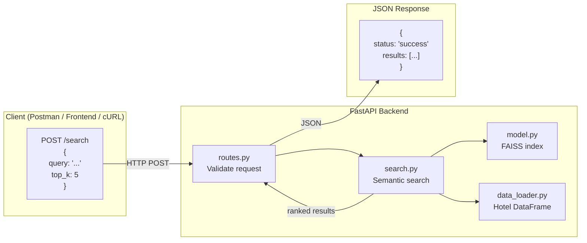
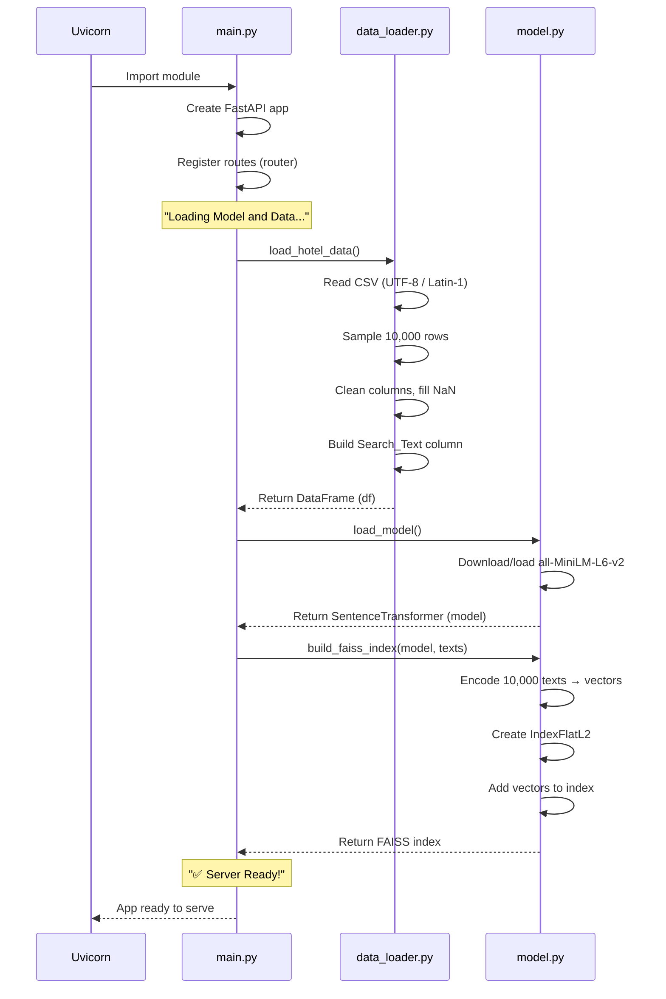
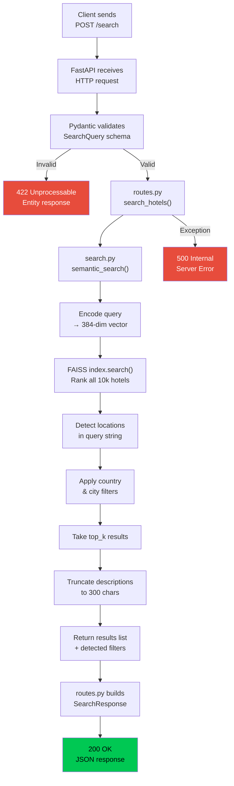
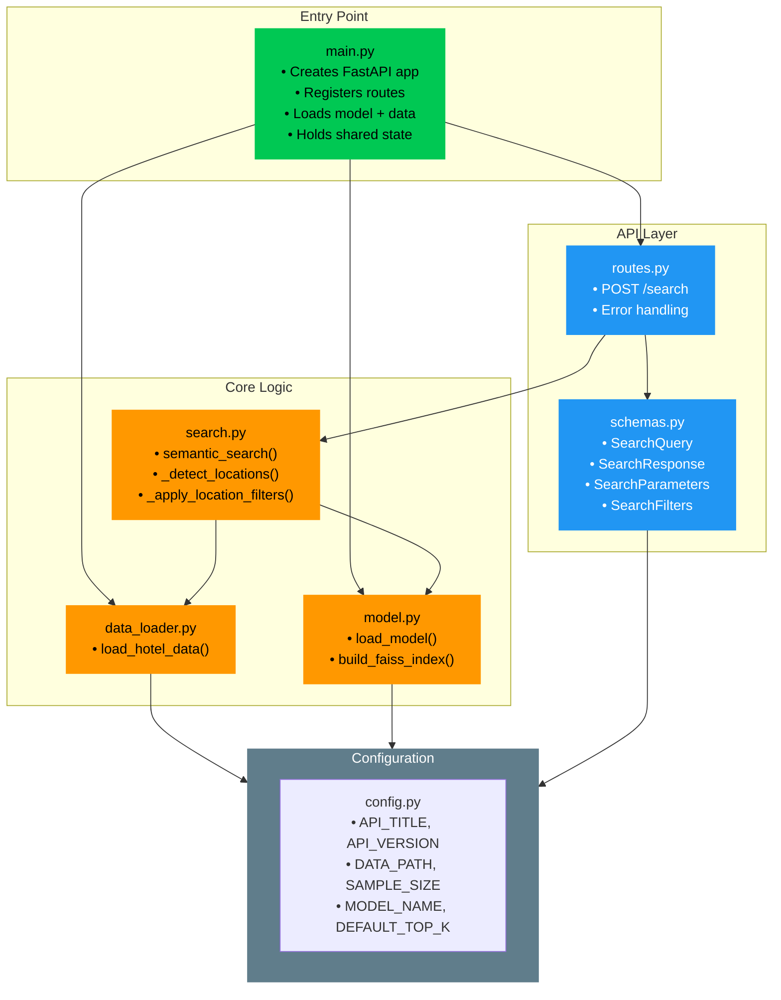
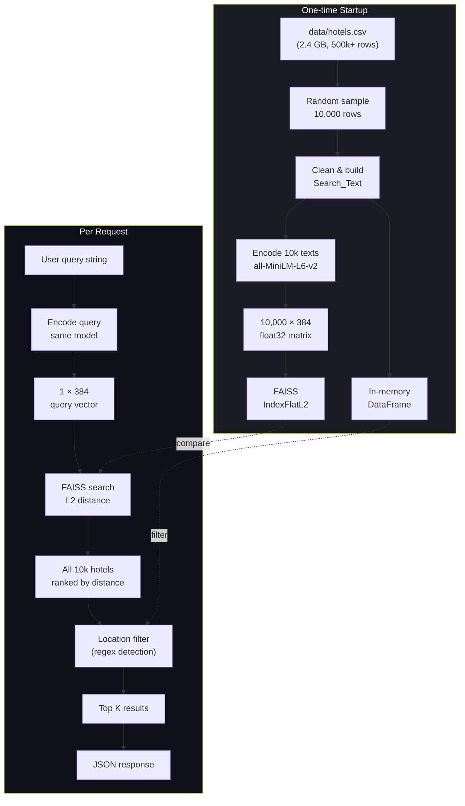
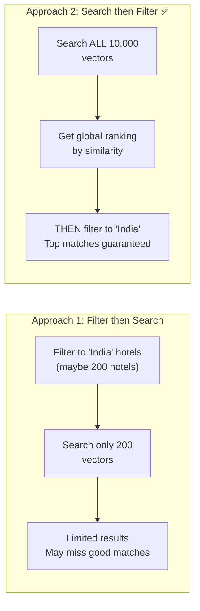
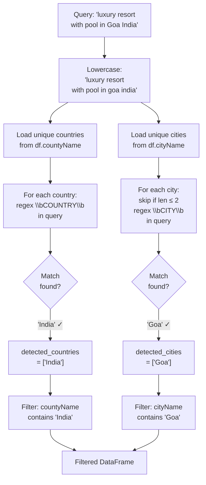
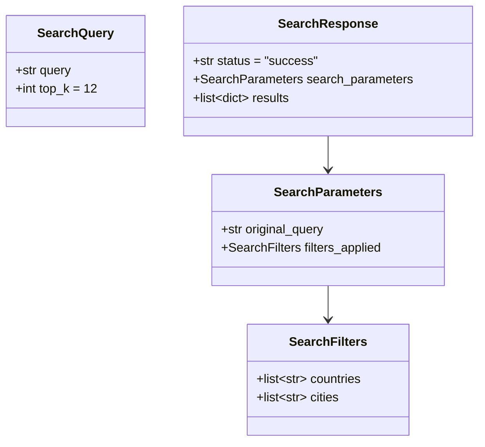
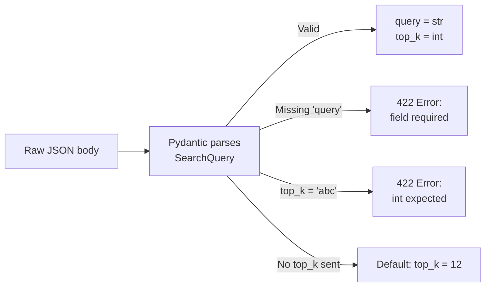

# FastAPI Backend — Architecture Deep Dive

This document explains the complete internal working of the **Semantic Hotel Search API** — from server startup to JSON response.

---

## Table of Contents

1. [System Overview](#1-system-overview)
2. [Startup Sequence](#2-startup-sequence)
3. [Request Lifecycle](#3-request-lifecycle)
4. [Module Breakdown](#4-module-breakdown)
5. [Data Flow Diagram](#5-data-flow-diagram)
6. [Semantic Search Pipeline](#6-semantic-search-pipeline)
7. [Location Detection Engine](#7-location-detection-engine)
8. [API Contract (Schemas)](#8-api-contract-schemas)
9. [Error Handling](#9-error-handling)
10. [Performance Characteristics](#10-performance-characteristics)
11. [Comparison: Monolithic vs Modular](#11-comparison-monolithic-vs-modular)

---

## 1. System Overview



The backend is a **stateless REST API** that holds the ML model and FAISS index **in memory**. Each request encodes the query, searches the index, applies location filters, and returns results — all in under 1 second.

---

## 2. Startup Sequence

When you run `uvicorn main:app`, the following happens **once** before any request is served:



### Startup timeline

| Step | What Happens | Approx. Time |
|------|-------------|--------------|
| CSV load & clean | Read 2.4 GB CSV, sample 10k, build Search_Text | ~5s |
| Model load | Download/cache `all-MiniLM-L6-v2` (22.7M params) | ~3s first time |
| Index build | Encode 10,000 texts → 384-dim vectors, build FAISS index | ~30-60s |
| **Total** | | **~40-70s first start** |

After the first run, the model is cached locally by `sentence-transformers`, reducing subsequent starts.

---

## 3. Request Lifecycle



### Step-by-step

1. **Request arrives** — FastAPI's ASGI server (Uvicorn) receives the HTTP POST.
2. **Schema validation** — Pydantic automatically validates the JSON body against `SearchQuery`. Missing `query` field → instant 422 error.
3. **Route handler** — `routes.py` calls `semantic_search()` with the validated data + shared resources (model, index, df).
4. **Query encoding** — The same `all-MiniLM-L6-v2` model encodes the query into a 384-dim vector.
5. **FAISS search** — Computes L2 distance to all 10,000 hotel vectors. Returns all hotels ranked by similarity.
6. **Location filtering** — Regex detects city/country names in the query string and filters the DataFrame.
7. **Top-K selection** — Takes the first `top_k` results after filtering.
8. **Response formatting** — Descriptions are truncated, and results are packaged into the `SearchResponse` schema.
9. **JSON sent** — FastAPI serializes the Pydantic model to JSON and sends the HTTP response.

---

## 4. Module Breakdown



### Why this structure?

| Principle | How It's Applied |
|-----------|-----------------|
| **Separation of concerns** | Routes don't know about FAISS. Search doesn't know about HTTP. |
| **Single responsibility** | Each file does exactly one thing. |
| **Dependency inversion** | `config.py` holds all constants; modules import from it, not from each other. |
| **Testability** | `semantic_search()` is a pure function — pass in model/index/df, get results back. No server needed for unit tests. |

---

## 5. Data Flow Diagram



---

## 6. Semantic Search Pipeline

### How `semantic_search()` works internally

```python
# File: search.py — simplified walkthrough

def semantic_search(query, top_k, model, index, df):

    # STEP 1: Encode the query into the same vector space as hotels
    query_vector = model.encode([query])        # Shape: (1, 384)

    # STEP 2: Find nearest neighbors in FAISS
    distances, indices = index.search(query_vector, len(df))
    # distances = [[0.23, 0.45, 0.67, ...]]   (L2 distances, ascending)
    # indices   = [[4521, 892, 3301, ...]]     (hotel row indices)

    # STEP 3: Reorder DataFrame by similarity
    results_df = df.iloc[indices[0]].copy()
    # Now row 0 = most similar hotel, row 9999 = least similar

    # STEP 4: Detect & apply location filters
    countries, cities = _detect_locations(query, df)
    results_df = _apply_location_filters(results_df, countries, cities)
    # Keeps only hotels in detected location (if any)

    # STEP 5: Return top K
    return results_df.head(top_k)
```

### Why search ALL hotels then filter?



We use **Approach 2** because:
- FAISS searches 10k vectors in < 5ms anyway (negligible cost)
- Ensures we get the **globally best** matches within the filtered location
- If the location filter returns nothing, we still have the global ranking to fall back on

---

## 7. Location Detection Engine



### Edge cases handled

| Scenario | How It's Handled |
|----------|-----------------|
| City name inside another word (e.g., "Paris" in "comparison") | `\b` word boundaries prevent partial matches |
| Special characters in names (e.g., "St. John's") | `re.escape()` safely escapes regex metacharacters |
| Very short city names (e.g., "Go", "Os") | Cities ≤ 2 chars are skipped entirely |
| No location mentioned | No filter applied; pure semantic ranking used |
| Multiple locations (e.g., "hotels in Paris or London") | Both cities detected; results include either |

---

## 8. API Contract (Schemas)



### Pydantic validation flow



---

## 9. Error Handling

| Layer | Error Type | HTTP Code | Handled By |
|-------|-----------|-----------|------------|
| **Pydantic** | Invalid/missing fields | 422 | FastAPI automatic |
| **Route** | Any unhandled exception | 500 | `try/except` in `routes.py` |
| **FAISS** | Index corruption | 500 | Caught by route handler |
| **Data** | Missing CSV | Crash at startup | Fails fast with traceback |

```python
# routes.py — error boundary
try:
    results, countries, cities = semantic_search(...)
    return SearchResponse(...)
except Exception as e:
    raise HTTPException(status_code=500, detail=str(e))
```

---

## 10. Performance Characteristics

### Startup cost (one-time)

| Operation | Time | Memory |
|-----------|------|--------|
| CSV load + sample | ~5s | ~200 MB |
| Model load | ~3s | ~80 MB |
| Encode 10k texts | ~30-60s | ~15 MB (vectors) |
| FAISS index build | < 1s | ~15 MB |
| **Total** | **~40-70s** | **~310 MB** |

### Per-request cost

| Operation | Time |
|-----------|------|
| Query encoding | ~5ms |
| FAISS search (10k vectors) | ~2ms |
| Location detection (regex) | ~10ms |
| DataFrame filtering | ~1ms |
| JSON serialization | ~1ms |
| **Total per request** | **~20ms** |

---

## 11. Comparison: Monolithic vs Modular

### Before (single `api.py` — 84 lines)

```
api.py
├── FastAPI app creation          (lines 9-14)
├── CSV loading & preprocessing   (lines 17-30)
├── Model loading & indexing      (lines 32-36)
├── Pydantic schema               (lines 40-42)
└── Search endpoint               (lines 45-84)
    ├── Query encoding
    ├── FAISS search
    ├── Location detection
    ├── Location filtering
    ├── Description truncation
    └── Response formatting
```

### After (7 files, clear boundaries)

```
main.py          → App creation + startup orchestration
config.py        → All constants in one place
data_loader.py   → Data ingestion (testable independently)
model.py         → ML model + index (swappable)
schemas.py       → API contract (self-documenting)
search.py        → Core logic (unit-testable, no HTTP dependency)
routes.py        → Thin controller (just wiring)
```

### Benefits

| Aspect | Monolithic | Modular |
|--------|-----------|---------|
| **Readability** | Scroll through 84 lines | Open the file you need |
| **Testability** | Must spin up full server | Test `semantic_search()` directly |
| **Team work** | Merge conflicts on one file | Each person owns a module |
| **Swapping models** | Edit deep in the file | Change `MODEL_NAME` in config |
| **Adding endpoints** | Grows the single file | Add to `routes.py`, logic in new module |

---
