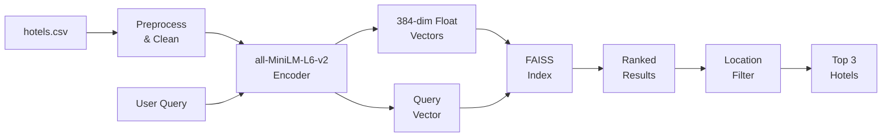
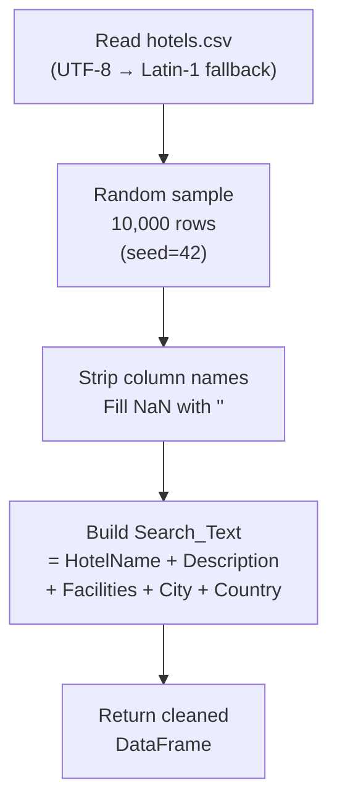
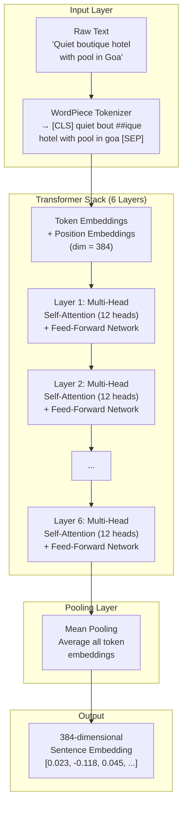
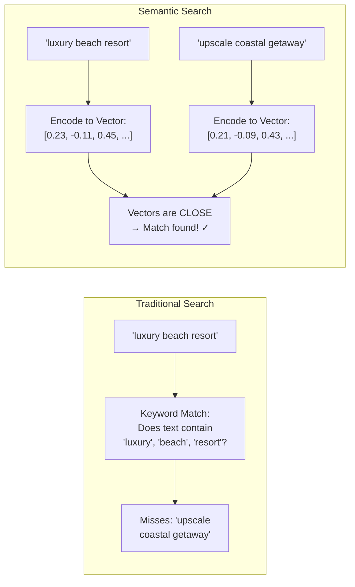
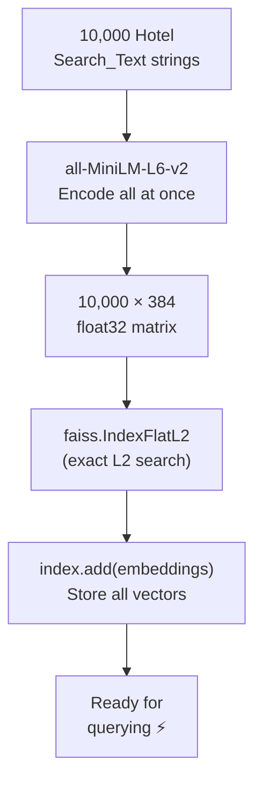
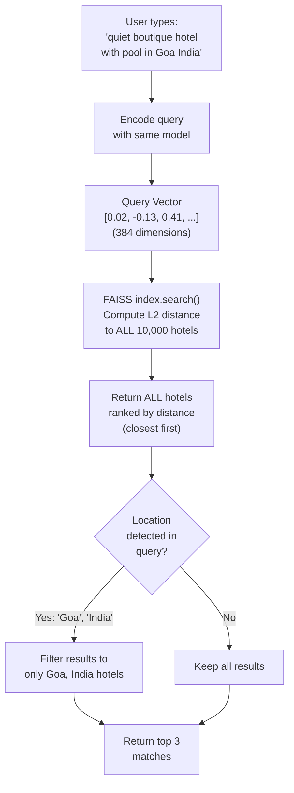
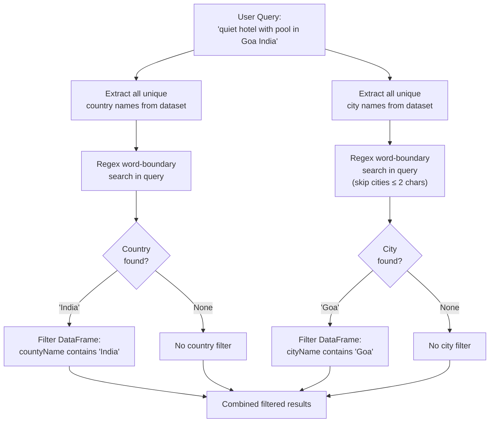
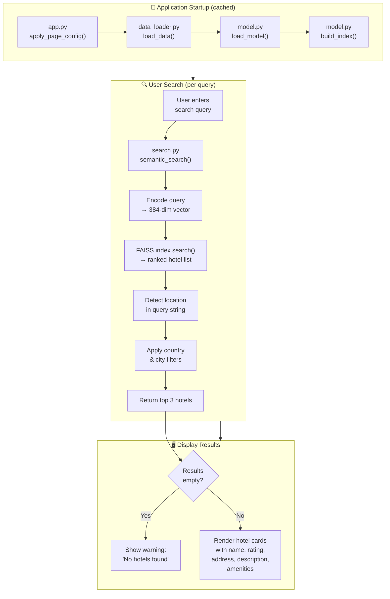
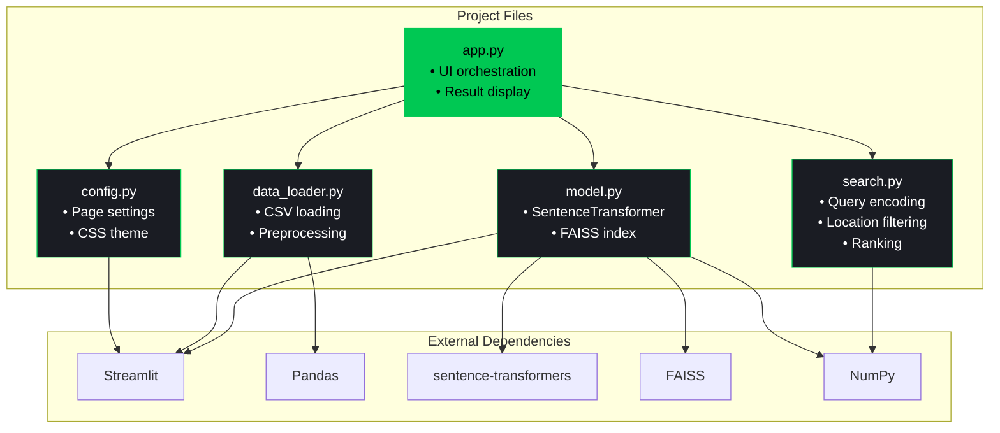

# 🧠 How It Works — Semantic Hotel Search (Deep Dive)

This document provides an in‑depth explanation of every layer of the **AI Travel Agent: Hotel Finder** — from raw CSV data to the final ranked results displayed on screen.

---

## Table of Contents

1. [High‑Level Pipeline](#1-high-level-pipeline)
2. [Data Ingestion & Preprocessing](#2-data-ingestion--preprocessing)
3. [The all‑MiniLM‑L6‑v2 Model — Architecture](#3-the-all-minilm-l6-v2-model--architecture)
4. [What Are Vector Embeddings?](#4-what-are-vector-embeddings)
5. [Building the FAISS Index](#5-building-the-faiss-index)
6. [Semantic Search — Query Flow](#6-semantic-search--query-flow)
7. [Smart Location Filtering](#7-smart-location-filtering)
8. [End‑to‑End Flowchart](#8-end-to-end-flowchart)
9. [Component Interaction Map](#9-component-interaction-map)
10. [Performance & Caching](#10-performance--caching)
11. [Glossary](#11-glossary)

---

## 1. High‑Level Pipeline



> The system converts **both** hotel descriptions and the user's natural‑language query into vectors in the **same 384‑dimensional space**, then finds the closest matches using FAISS.

---

## 2. Data Ingestion & Preprocessing

**File:** `data_loader.py`



### What happens at each step

| Step | Purpose |
|------|---------|
| **CSV read with fallback** | Handles different file encodings gracefully |
| **Random sample of 10,000** | Keeps the app fast while giving geographic diversity (using `random_state=42` for reproducibility) |
| **Column cleaning** | Removes stray whitespace from headers |
| **`fillna('')`** | Prevents `NaN` from breaking string operations |
| **`Search_Text` column** | A single concatenated string that gives the AI model full context about each hotel |

### Why concatenate into `Search_Text`?

The sentence‑transformer encodes **one string at a time**. By combining the hotel name, description, facilities, city, and country into a single string, the resulting embedding captures the **full semantic meaning** of that hotel — its vibe, location, and amenities — in one vector.

---

## 3. The all‑MiniLM‑L6‑v2 Model — Architecture

**File:** `model.py`

### 3.1 Model Lineage

```
BERT (Google, 2018)
  └── DistilBERT (Hugging Face, 2019)  — 40% smaller, 97% performance
        └── MiniLM (Microsoft, 2020)    — Knowledge distillation from large teacher
              └── all-MiniLM-L6-v2 (Sentence-Transformers, 2021)
                    — Fine‑tuned on 1B+ sentence pairs for semantic similarity
```

### 3.2 Architecture Breakdown



### 3.3 Key Specifications

| Property | Value |
|----------|-------|
| **Parameters** | ~22.7 million |
| **Layers** | 6 Transformer layers |
| **Hidden Size** | 384 |
| **Attention Heads** | 12 |
| **Max Sequence Length** | 256 tokens |
| **Output Dimensions** | 384 |
| **Training Data** | 1B+ sentence pairs (NLI, QA, web, forums) |
| **Similarity Metric** | Cosine similarity / L2 distance |
| **Speed** | ~14,000 sentences/sec on GPU |

### 3.4 How Self‑Attention Works (Simplified)

Self‑attention allows each word to "look at" every other word in the sentence to understand context:

```
Input:  "quiet boutique hotel with pool"

           quiet  boutique  hotel  with  pool
quiet      0.15    0.25     0.20   0.05  0.35  ← "quiet" attends heavily to "pool" (quiet pool)
boutique   0.10    0.20     0.50   0.05  0.15  ← "boutique" attends to "hotel" (boutique hotel)
hotel      0.08    0.40     0.15   0.07  0.30  ← "hotel" attends to "boutique" and "pool"
with       0.10    0.10     0.10   0.10  0.60  ← "with" attends to "pool" (with pool)
pool       0.30    0.05     0.25   0.15  0.25  ← "pool" attends to "quiet" (quiet pool)
```

> Each attention score is a learned weight. The 12 heads learn **different relationship patterns** (syntax, semantics, co-occurrence, etc.) simultaneously.

### 3.5 Mean Pooling

After the transformer processes all tokens, we have a 384‑dimensional vector **per token**. Mean pooling averages them:

```
Token embeddings (simplified to 4-dim):
  [CLS]     → [0.1, 0.3, -0.2, 0.5]
  quiet     → [0.2, 0.1,  0.4, 0.3]
  boutique  → [0.3, 0.2,  0.1, 0.6]
  hotel     → [0.1, 0.4,  0.3, 0.2]
  [SEP]     → [0.0, 0.1,  0.0, 0.1]

Mean Pool  → [0.14, 0.22, 0.12, 0.34]   ← THIS is the sentence embedding
```

This single vector captures the **overall meaning** of the entire sentence.

---

## 4. What Are Vector Embeddings?

### 4.1 The Core Idea

A **vector embedding** is a list of numbers (a point in high‑dimensional space) that represents the **meaning** of a piece of text.



### 4.2 Semantic Similarity in Vector Space

Texts with **similar meanings** land **close together** in the 384‑dimensional space:

```
                    ·  "5-star beachfront resort with infinity pool"
                   ·   "luxury seaside hotel with swimming pool"
                  ·     ← These cluster together

    · "budget hostel in city center"
   ·  "cheap downtown backpacker lodge"
         ← These cluster together (far from the beach cluster)

                          · "quiet mountain cabin with fireplace"
                         ·  "cozy hillside retreat with wood stove"
                               ← These cluster together
```

### 4.3 Distance = Dissimilarity

We use **L2 (Euclidean) distance** in this project:

```
distance = √( (a₁-b₁)² + (a₂-b₂)² + ... + (a₃₈₄-b₃₈₄)² )
```

- **Small distance** → texts mean similar things → **good match**
- **Large distance** → texts are unrelated → **poor match**

---

## 5. Building the FAISS Index

**File:** `model.py` → `build_index()`

### 5.1 What is FAISS?

**FAISS** (Facebook AI Similarity Search) is a library optimized for searching through millions of vectors quickly. Instead of comparing the query against every single hotel one by one (brute force), FAISS uses optimized data structures.

### 5.2 Index Construction



### 5.3 Why IndexFlatL2?

| Index Type | Speed | Accuracy | Memory | Best For |
|-----------|-------|----------|--------|----------|
| **`IndexFlatL2`** | Moderate | 100% exact | ~15 MB for 10k | Small–medium datasets |
| `IndexIVFFlat` | Fast | ~95-99% | Lower | 100k–1M vectors |
| `IndexHNSW` | Very Fast | ~95-99% | Higher | 1M+ vectors |

For 10,000 hotels, `IndexFlatL2` gives **exact** nearest‑neighbor results with negligible latency.

---

## 6. Semantic Search — Query Flow

**File:** `search.py` → `semantic_search()`



### Step‑by‑Step Walkthrough

1. **Query encoding** — The same `all-MiniLM-L6-v2` model that encoded hotels now encodes the user's query into a 384‑dim vector.
2. **FAISS search** — Computes L2 distance between the query vector and all 10,000 hotel vectors. Returns indices sorted by ascending distance.
3. **Location filter** — Regex‑based detection of city/country names in the query string (see §7).
4. **Top‑K selection** — After filtering, the top 3 closest hotels are returned.

> **Why use the same model?** Both the query and hotel descriptions must live in the **same vector space** for distances to be meaningful. Using a different model would place them in incompatible spaces.

---

## 7. Smart Location Filtering

**File:** `search.py`

The semantic search already biases toward hotels in the mentioned location (because "Goa India" is in the `Search_Text`). But to guarantee precision, we apply an **explicit regex filter** on top.



### Why word‑boundary regex?

```python
re.search(rf"\b{re.escape(c.lower())}\b", query_lower)
```

- `\b` ensures **"Paris"** doesn't match inside **"comparison"**
- `re.escape()` handles city names with special characters (e.g., "St. John's")
- Cities ≤ 2 characters are skipped to avoid false matches (e.g., "Go" inside "Goa")

---

## 8. End‑to‑End Flowchart



---

## 9. Component Interaction Map



---

## 10. Performance & Caching

Streamlit's caching decorators ensure expensive operations run **only once**:

| Function | Decorator | What's Cached | Approx. Time |
|----------|-----------|---------------|--------------|
| `load_data()` | `@st.cache_data` | Cleaned DataFrame (10k rows) | ~5s first load |
| `load_model()` | `@st.cache_resource` | SentenceTransformer model (~80 MB) | ~3s first load |
| `build_index()` | `@st.cache_resource` | FAISS index with 10k vectors | ~30-60s first load |

After the first run, subsequent queries return results in **< 1 second** because the model and index are already in memory.

### cache_data vs cache_resource

- **`@st.cache_data`** — For serializable data (DataFrames, lists). Creates a copy per caller.
- **`@st.cache_resource`** — For non-serializable objects (ML models, DB connections). Shared across all users.

---

## 11. Glossary

| Term | Definition |
|------|-----------|
| **Embedding** | A fixed‑size numerical vector representing the semantic meaning of text |
| **Transformer** | A neural network architecture based on self‑attention mechanisms |
| **Self‑Attention** | A mechanism that lets each token weigh the importance of every other token |
| **FAISS** | Facebook AI Similarity Search — a library for efficient vector similarity search |
| **L2 Distance** | Euclidean distance between two points; smaller = more similar |
| **Mean Pooling** | Averaging all token vectors to produce a single sentence vector |
| **WordPiece** | A tokenization method that splits unknown words into known subwords |
| **Semantic Search** | Finding results based on meaning rather than exact keyword matching |
| **IndexFlatL2** | A FAISS index type that performs exact (brute-force) L2 nearest neighbor search |
| **Knowledge Distillation** | Training a small "student" model to mimic a large "teacher" model |

---

